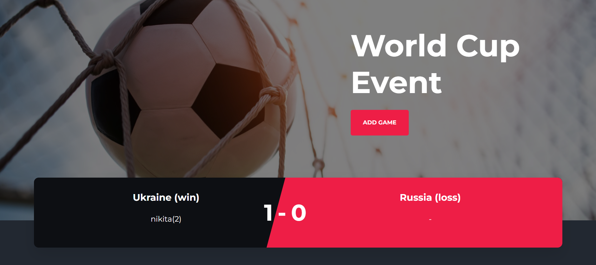
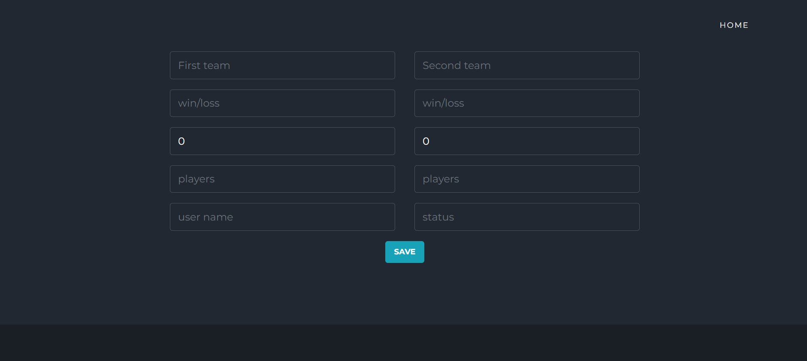
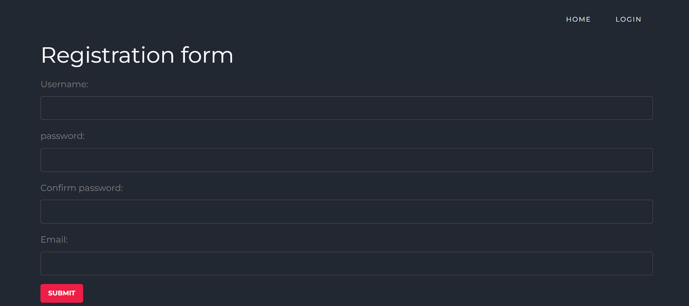
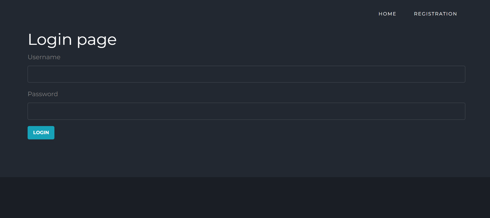
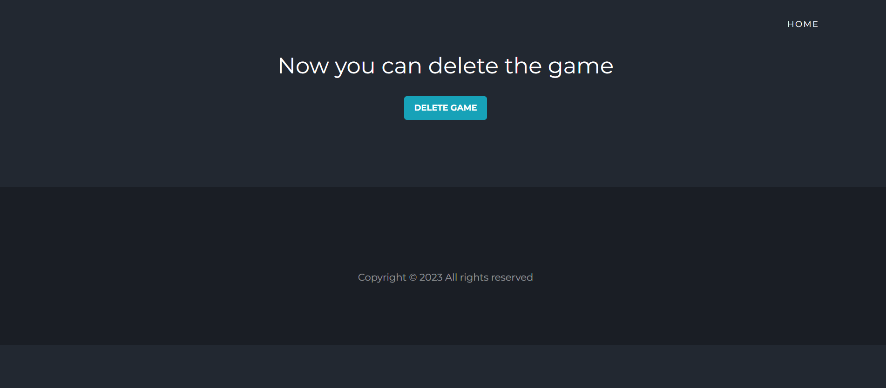

## The purpose of this site 

This site has intention of enabling users not only to read and review football event, but to participate by registering and leaving comments below events. Our goal is to create a community which would share their impression.

## User Experience: User Goals

**First time site visitors would like to**

 * Easily navigate on the site.
 * Read posts and see the options to register/login in order to leave their comments and create events.

**Returning registered users would like**

  * View, create, edit and delete events and comments.
  * View other users and events.

## User Experience: Site Owners Goals

 * Enable easy to navigate experience for every site visitor or user.
 * Enable any site visitor to easily create account.
 * Enable every user to easily log in.

## User Experience: User Stories
1. As a Site Admin I can create, edit and delete posts so that I can fully manage blog content (implemented).
2. As a Site Admin I can edit and delete comments so that I have full CRUD control over the comments section (not implemented).
3. As a site user I can view a list of events (implemented).
4. As a site user I can register my own account so that I can add new events (implemented).
5. As a site user I can register my own account so that I can leave comments below events (not implemented).
6. As a site user I can update and delete events (implemented).
7. As a site user I can easily login (implemented).
8. As a site user I can easily logout (implemented).

## User Experience: Strategy
* Focus:
The focus of this project is to provide information and teams's statistic of Soccer world cup.
* Definition:
Soccer world cup is a site for visitors who want to share their opinion about the tournament.
* Value:
The registered users can leave comments and see other users's comments below all events.

## User Experience: Scope
**Features**:
- **Navigation menu** - The navigation menu is clear and consistent for all visitors and users.

- **Home page** - Home page enables visitors/users to easily view events or use navigation menu functions.

- **Register/Login page** - Site visitors can register at register page or sign in at login page.

- **Update/Delete event** - Registered users can edit/delete their own events.

- **Admin page** - This page is restricted to the site administrator and is used for the full control of all tournament features.

   **Planned Features:**
  * The site should be responsive, intuitive and easy to navigate on all devices.
  * Home page should provide easy navigation.
  * Users should be able to easily register/login/logout.
  * Only registered users can update or delete comments and events.
  * Unregistered users can view the posts without comments.

## User Experience: Skeleton
For this project [bootstrap template](https://themewagon.com/themes/free-bootstrap-html5-sports-website-template-soccer/) was used.

## User Experience: Technologies
* HTML5 
* CSS3 
* Python
* Django
* FontAwesome 
* Google Fonts
* GitPod 
* GitHub  
* Heroku

## Existing Features
* Navbar: There is a consistent navbar present for all pages within the site.

* Footer: There is a consistent footer present for all pages within the site.

* Home page: Home page immediately enables visitors to see current events, score table and next game.

* Add game: The page allows users to add new event to the tournament.

* Register page: This page can be opened via the register button in the navigation bar.New site visitors are simply asked to enter username, email address, password and password confirmation to register for the use of this site. Once successfully registered, users will be redirected to the home page.

* Login page: Registered and returning users can use the login button to open the login page and supply their username and password to login. On successful login, users will be redirected to the home page and they will be aware of it due to login username displayed in the upper right navbar area.

* Delete event page: Delete event page for registered users only.

## Features Left to Implement
Due to the short space of time given to complete this project, I was unable to implement following planned features:

  * Event comments
  * Email authentication
  * Calculation and update of score table

## Testing: Responsiveness
The site is tested to ensure all pages are displayed appropriately in all screen sizes.

## Testing: Manual testing
Manual testing was conducted to ensure the site works as intended.

###  Validating code - Python, HTML, CSS, JS
All the .py files are validated in the PEP8 online validator.

No errors were returned when passing through the official W3C validator, just several warnings due to django generated elements.

No errors were found when passing through the official (Jigsaw) validator.

Some warnings were found when passing JS code through the validator.

## Setting up Django environment.
Following additional packages are installed to create this site by using pip3 install:
  
  * gunicorn
  * psycopg2

## Deployment

1. In the Heroku dashboard, click "new", then enter the app name and specify the region.

2. In the Add-on section in the resources tab, search postgres, then select Heroku Postgres and submit order from button in the popup window.

3. In the setting tab, click on Reveal Config Vars button then copy the value for DATABASE_URL key.

4. Create env.py directly under the repo directory same lavel as manage.py and make sure the file name is included in .gitignore as this is a setting for local development site in Gitpod. 
Heroku Config vars need to be set accordingly including DATABASE_URL and SECRET_KEY

5. In setting.py file include the following code:

    import os
    import dj_database_url
    if os.path.isfile('env.py'):
        import env
    modify SECRET_KEY line to SECRET_KEY = os.
    environ.get('SECRET_KEY')

    Replace DATABASES as
    DATABASES = {
        'default': dj_database_url.parse(os.environ.get('DATABASE_URL'))
    }

6. In the Gitpod terminal, migrate the change by
"python3 manage.py migrate". Check the resource tab in heroku and choose 
Heroku Postgres, then ensure the changes are reflected in the database.

7. Login to Cloudinary and copy the API Environment variable and paste in "env.py" and also Config Vars in Heroku.

8. DISABLE_COLLECTSTATIC set to 1 in Config Vars in Heroku as the initial deployment does not contain static files yet.

9. In settings.py configure the following:
 
    * Add 'cloudinary_storage', before 'django.contrib.staticfiles', and 'cloudinary' after it.

    * Set STATICFILES_DIRS, STATICFILES_DIRS, STATIC_ROOT, MEDIA_URL and DEFAULT_FILE_STORAGE so that Django can use the directories appropriately.

    * Set TEMPLATES_DIR just below BASE_DIR and insert TEMPLATES_DIR in TEMPLATES array
    'DIRS': []

    * Set ALLOWED_HOSTS array as 'dailyfoodie.herokuapp.com', 'localhost'

10. Create Procfile with the contents: 

    web: gunicorn dailyfoodie.wsgi

11. In the deployment tab in Heroku page, connect to GitHub and search for the repository then Connect.

    Click on "Deploy Branch"